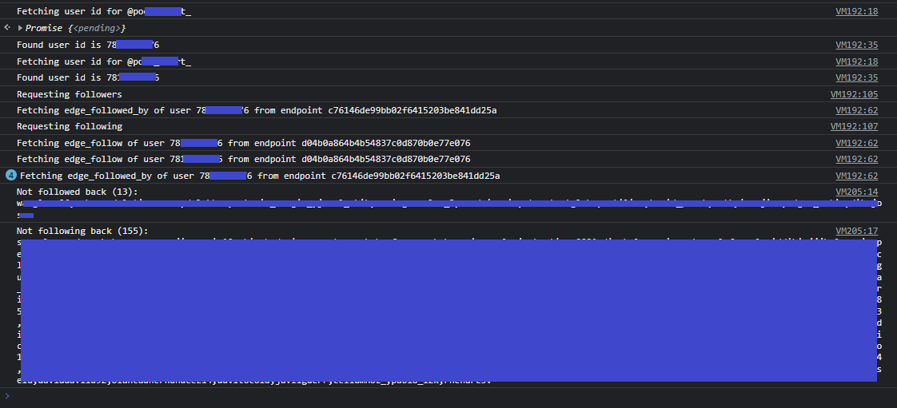

# Instagram followers

A sample to fetch followers/following data from Instragram's GraphQL API and check not followed/following back

## Usage

1. Open Instagram in a browser
2. Log in
3. Copy-paste into the Dev Tools console the code in [instagramFollowers.js](../instagramFollowers.js)

